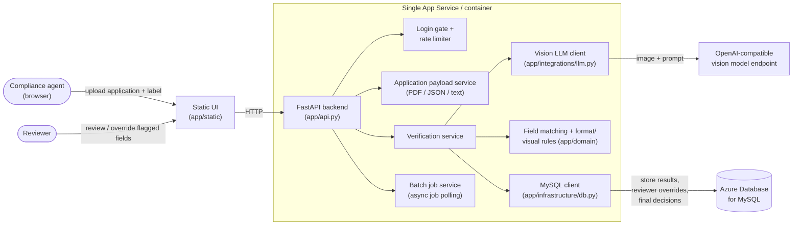
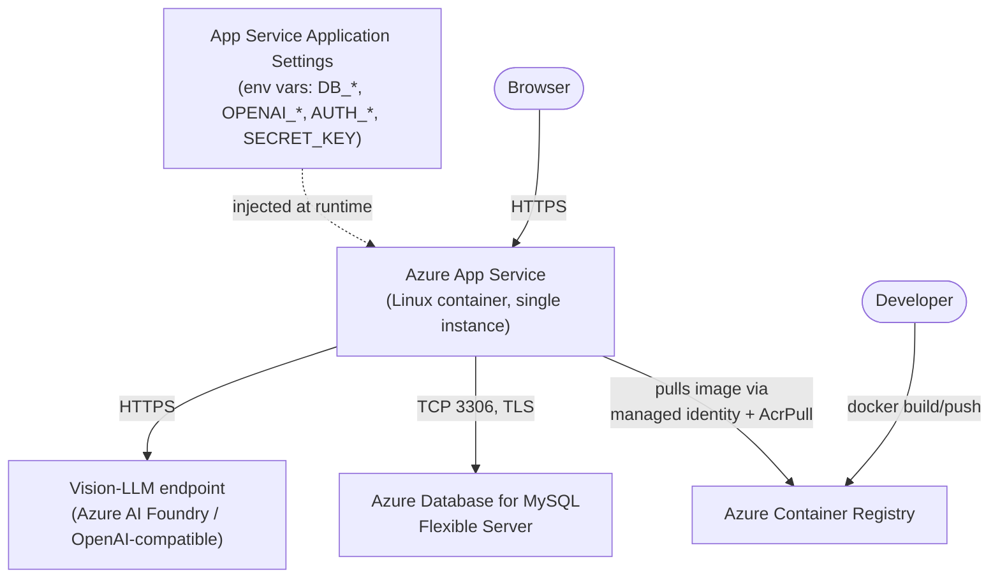

# Alcohol Label Verification — Prototype

> **Want to try the deployed service instead of running it yourself?** It's live at
> [https://alcver-app-robert.azurewebsites.net/](https://alcver-app-robert.azurewebsites.net/) — email
> [robertzhongzhou@gmail.com](mailto:robertzhongzhou@gmail.com) to request login credentials.

A web app that compares a TTB label application (JSON, PDF, or text) against a photo of the
actual bottle label, using a vision-capable LLM to extract label fields and a set of
deterministic rules to flag matches, mismatches, and items that need human review.

For the reasoning behind the design choices (approach, tools, assumptions), see
[APPROACH.md](APPROACH.md). For a screenshot-driven walkthrough of the UI, see
[USAGE.md](USAGE.md).

## Architecture at a glance



- **Backend:** FastAPI ([app/api.py](app/api.py)), single process, no background workers beyond
  an in-process batch job runner.
- **Extraction:** a single vision-LLM call per label image ([app/integrations/llm.py](app/integrations/llm.py))
  returns structured JSON (brand, class/type, ABV, net contents, producer/address, country of
  origin, government warning + a small set of visual attributes). No OCR engine is used.
- **Comparison:** fuzzy text matching and unit-aware numeric comparisons
  ([app/domain/label_utils.py](app/domain/label_utils.py)) plus format/visual rule checks
  ([app/domain/format_validator.py](app/domain/format_validator.py)) turn extracted fields into
  `pass` / `need_review` / `failure` verdicts per field and per case.
- **Storage:** MySQL ([app/infrastructure/db.py](app/infrastructure/db.py)) persists verification
  results, reviewer overrides, and final decisions for audit purposes. Schema is created/upgraded
  automatically on startup — no manual DDL required.
- **Frontend:** a single static page ([app/static/index.html](app/static/index.html)) with plain
  JS/CSS — single-case upload, batch upload, and a review screen for flagged fields.
- **Auth:** an optional username/password login gate (session cookie) and an optional shared API
  key for programmatic access, plus per-client rate limiting on LLM-backed endpoints.

### Azure deployment topology




- Python 3.11+
- A MySQL server (local install, Docker container, or Azure Database for MySQL)
- An OpenAI-compatible vision model endpoint (this project was built against an Azure AI Foundry
  `gpt-4.1-mini` deployment, but any OpenAI-compatible vision endpoint works)
- Docker Desktop (only needed if you want to build/run the container image)

## Local setup

1. Create and activate a virtual environment, then install dependencies:

   ```powershell
   python -m venv .venv
   .venv\Scripts\activate
   pip install -r requirements.txt
   ```

2. Create a `.env` file in the project root (never commit this file — it's already gitignored):

   ```dotenv
   OPENAI_BASE_URL=<your OpenAI-compatible endpoint>
   OPENAI_API_KEY=<your API key>
   LLM_MODEL=gpt-4.1-mini
   OPENAI_API_VERSION=

   DB_HOST=localhost
   DB_PORT=3306
   DB_USER=alcuser
   DB_PASSWORD=alcpass
   DB_NAME=alcohol_label_verification

   # Optional login gate — leave both blank to disable
   AUTH_USERNAME=admin
   AUTH_PASSWORD=<choose a password>
   SECRET_KEY=<random hex string, e.g. via `python -c "import secrets;print(secrets.token_hex(32))"`>

   # Set to 1 only when serving over HTTPS
   SESSION_COOKIE_SECURE=0
   ```

   All settings and their defaults are documented in [app/config.py](app/config.py).

3. Make sure the target database exists (the app creates its own tables, but not the database
   itself):

   ```sql
   CREATE DATABASE IF NOT EXISTS alcohol_label_verification;
   ```

4. Run the app:

   ```powershell
   uvicorn app.main:app --reload --host 0.0.0.0 --port 8000
   ```

5. Open http://localhost:8000 in a browser. Sign in if a login is configured, then upload an
   application plus a label image (single case) or use the batch tab for multiple pairs at once.

## Running tests

```powershell
pytest
```

Tests exercise the full verify flow against sample fixtures in [sample_cases](sample_cases). A
couple of tests assert on live LLM output and can occasionally fail due to model variance rather
than a code defect.

## Docker

Build and run the container locally:

```powershell
docker build -t alcver-app:latest .
docker run --rm -p 8000:8000 --env-file .env alcver-app:latest
```

The image expects the same environment variables as local setup; `DB_HOST` will need to point at
a reachable MySQL instance (not `localhost`, unless you use `host.docker.internal` on
Windows/Mac).

## Deploying to Azure (single-instance prototype)

This prototype is designed to run as a single App Service instance backed by a single Azure
Database for MySQL Flexible Server — no Kubernetes, no Key Vault, no autoscaling. Secrets are
passed directly as App Service application settings.

Condensed steps (adjust names/regions to your subscription's quota):

```powershell
$RG = "alcver-rg"; $LOCATION = "centralus"
$ACR_NAME = "<globally-unique-acr-name>"
$MYSQL_SERVER = "<globally-unique-mysql-name>"
$PLAN_NAME = "alcver-plan"; $WEBAPP_NAME = "<globally-unique-webapp-name>"

az group create --name $RG --location $LOCATION

# Container registry + image
az acr create --resource-group $RG --name $ACR_NAME --sku Basic --admin-enabled false
az acr login --name $ACR_NAME
docker build -t "$ACR_NAME.azurecr.io/alcver-app:latest" .
docker push "$ACR_NAME.azurecr.io/alcver-app:latest"

# MySQL Flexible Server + database + firewall
az mysql flexible-server create --resource-group $RG --name $MYSQL_SERVER `
  --location $LOCATION --sku-name Standard_B1ms --tier Burstable `
  --storage-size 20 --admin-user <admin> --admin-password <password> --version 8.0
az mysql flexible-server db create --resource-group $RG --server-name $MYSQL_SERVER `
  --database-name alcohol_label_verification
az mysql flexible-server firewall-rule create --resource-group $RG --name $MYSQL_SERVER `
  --rule-name AllowAzureServices --start-ip-address 0.0.0.0 --end-ip-address 0.0.0.0

# App Service plan + web app
az appservice plan create --resource-group $RG --name $PLAN_NAME --location $LOCATION `
  --is-linux --sku B1
az webapp create --resource-group $RG --plan $PLAN_NAME --name $WEBAPP_NAME `
  --deployment-container-image-name "$ACR_NAME.azurecr.io/alcver-app:latest"

# Managed identity so the web app can pull from ACR without stored credentials
az webapp identity assign --resource-group $RG --name $WEBAPP_NAME
$PRINCIPAL_ID = az webapp identity show --resource-group $RG --name $WEBAPP_NAME --query principalId -o tsv
$ACR_ID = az acr show --resource-group $RG --name $ACR_NAME --query id -o tsv
az role assignment create --assignee-object-id $PRINCIPAL_ID --assignee-principal-type ServicePrincipal `
  --role AcrPull --scope $ACR_ID
'{"acrUseManagedIdentityCreds": true}' | Out-File -FilePath acr_creds.json -Encoding ascii -NoNewline
az webapp config set --resource-group $RG --name $WEBAPP_NAME --generic-configurations "@acr_creds.json"
Remove-Item acr_creds.json

# App settings (secrets)
az webapp config appsettings set --resource-group $RG --name $WEBAPP_NAME --settings `
  WEBSITES_PORT=8000 `
  DB_HOST="$MYSQL_SERVER.mysql.database.azure.com" DB_PORT=3306 `
  DB_USER=<admin> DB_PASSWORD=<password> DB_NAME=alcohol_label_verification `
  OPENAI_BASE_URL=<endpoint> OPENAI_API_KEY=<key> LLM_MODEL=gpt-4.1-mini `
  AUTH_USERNAME=admin AUTH_PASSWORD=<password> SECRET_KEY=<hex> SESSION_COOKIE_SECURE=1

az webapp log config --resource-group $RG --name $WEBAPP_NAME --docker-container-logging filesystem
az webapp restart --resource-group $RG --name $WEBAPP_NAME
```

Then browse to `https://<webapp-name>.azurewebsites.net`.

> **Note:** on constrained/trial subscriptions, some regions may reject `B1` App Service quota or
> MySQL provisioning. Try a couple of alternate regions (e.g. `eastus2`, `centralus`, `westus2`)
> if you hit `ProvisionNotSupportedForRegion` or quota errors.

## API summary

| Endpoint | Purpose |
| --- | --- |
| `POST /api/verify` | Verify one application against one label image |
| `POST /api/batch` | Queue a batch job (many application/label pairs), returns a job id |
| `GET /api/jobs/{job_id}` | Poll batch job status/results |
| `GET /api/results/{result_id}` | Fetch a saved verification result |
| `POST /api/results/{result_id}/review` | Record a reviewer decision/override for one field |
| `POST /api/results/{result_id}/final-decision` | Record the case's final human decision |
| `POST /api/login` / `POST /api/logout` / `GET /api/session` | Session-based login gate |

## Project structure

```
app/
  api.py                  FastAPI routes, auth, rate limiting
  config.py               Environment-driven configuration
  domain/                 Field matching + format/visual validation rules
  integrations/llm.py     Vision-LLM extraction client
  infrastructure/db.py    MySQL connection + schema + persistence
  services/               Verification, batch job, application-payload, rate-limiter services
  static/                 Single-page browser UI
tests/                    Pytest suite against sample fixtures
sample_cases/             Sample application + label pairs used by tests
scripts/                  Helper scripts for generating sample/test data
```
