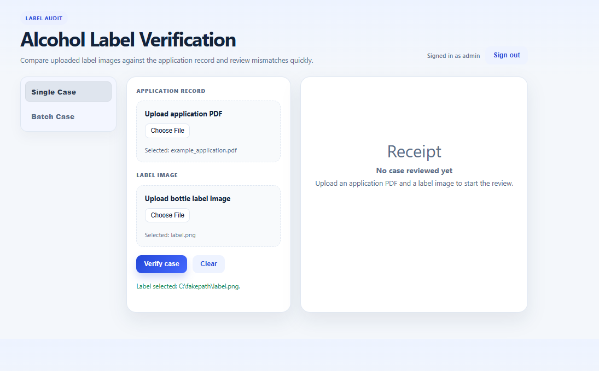
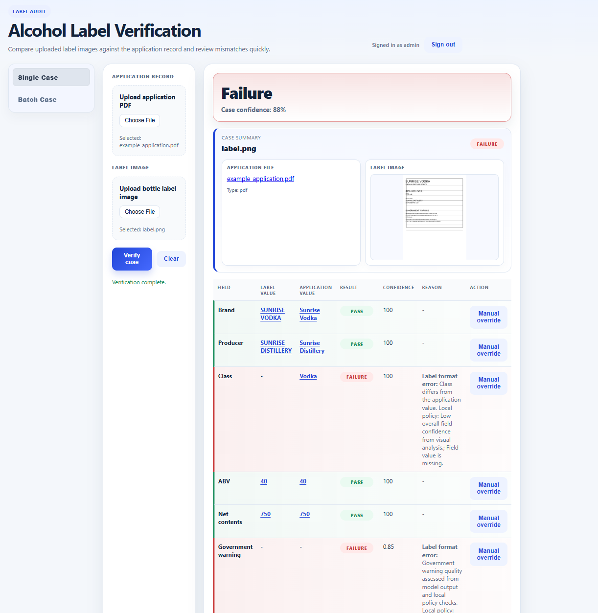
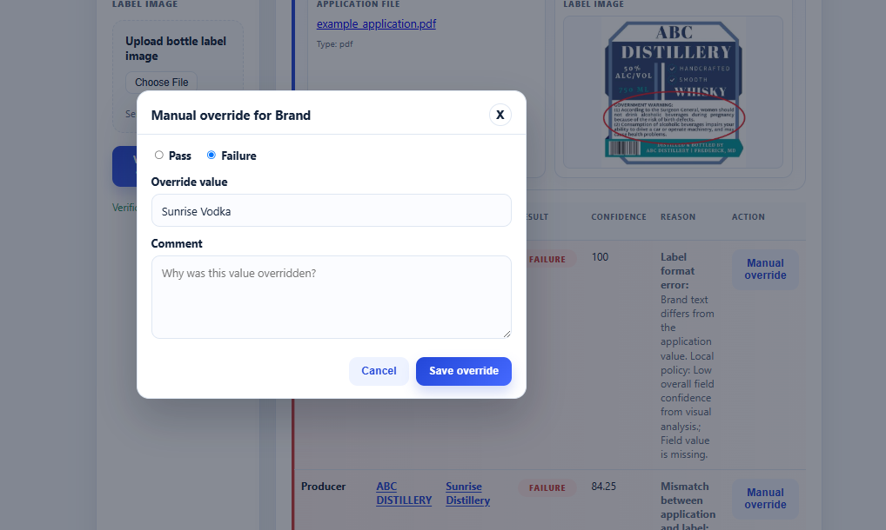
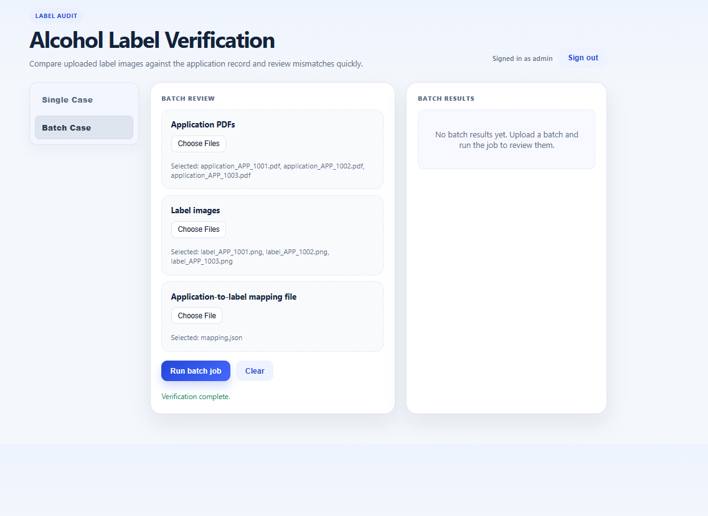
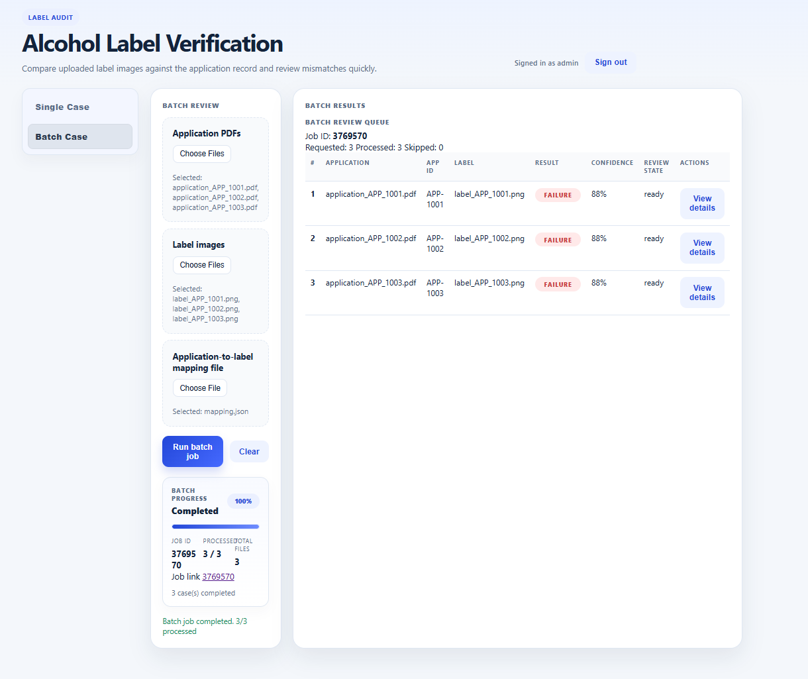
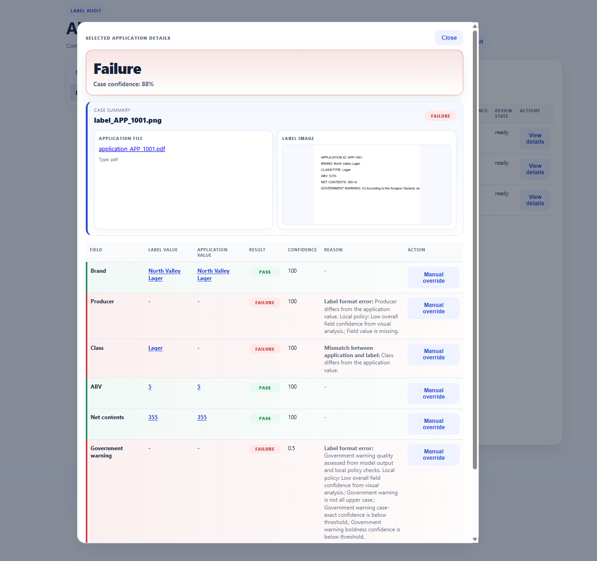

# Using the Alcohol Label Verification tool

This walks through the two main workflows: verifying a single application/label pair, and
running a batch of many pairs at once. See [README.md](README.md) for setup/run instructions and
[APPROACH.md](APPROACH.md) for the reasoning behind the design.

## What you need before you start

Each case needs exactly **one application record and one label photo**:

- **Application record** — a PDF (preferred), or a JSON/text file, containing the label's
  declared `brand`, `class`, `abv`, `net_contents`, `government_warning_present`,
  `producer_name`, and `country_of_origin`. It must be a text-based PDF (not a scanned image of
  text) so it can be parsed directly. See
  [sample_cases/example_application.pdf](sample_cases/example_application.pdf) and
  [sample_cases/clean_ocr_case/application.json](sample_cases/clean_ocr_case/application.json)
  for examples.
- **Label photo** — a single PNG/JPEG photo of the bottle's label, clear enough to read all
  required fields in one image. Only one photo per case is supported (not separate front/back
  shots). See [sample_cases/clean_ocr_case/label.png](sample_cases/clean_ocr_case/label.png) and
  [sample_cases/mismatch_case/label.png](sample_cases/mismatch_case/label.png) for examples.
- **For batch jobs**, you also need a mapping file (JSON) that pairs each application filename to
  its matching label filename — see [examples/mapping.json](examples/mapping.json) (or the
  larger [sample_cases/batch_fixture/mapping.json](sample_cases/batch_fixture/mapping.json)
  10-pair example) for the exact format. Any application/label file not listed in the mapping is
  treated as an error, not guessed by filename similarity.

See [APPROACH.md](APPROACH.md#input-format-assumptions) for the full reasoning behind these
input assumptions.

## Single case: verify one label

1. Open the app and select the **Single Case** tab (selected by default). Upload the
   application record (PDF) and the bottle label photo, then click **Verify case**.

   

2. Results appear on the right within a few seconds: an overall case verdict
   (`Pass` / `Need review` / `Failure`) with a confidence score, the source files side by side,
   and a field-by-field breakdown (Brand, Producer, Class, ABV, Net contents, Government warning).
   Each field shows the label value, the application value, a result, a confidence score, and —
   for anything other than a clean pass — a plain-language reason.

   

3. Any field can be corrected by a reviewer. Click **Manual override** on a field to record the
   correct value, mark it Pass/Failure, and leave a comment explaining why it was overridden. This
   keeps a full audit trail — nothing is silently changed.

   

## Batch case: verify many labels at once

Useful when an importer submits many applications together — upload every application PDF, every
label image, and a mapping file that pairs each application to its matching label (see "What you
need before you start" above), then run the whole batch as one job.

1. Switch to the **Batch Case** tab. Upload all application PDFs, all label images, and a mapping
   file (JSON) that links each application to its corresponding label filename. Click **Run batch
   job**.

   

   **The mapping file** is what tells the app which application goes with which label — it's
   required for every batch job, since filenames alone aren't assumed to be enough to pair them
   up reliably. [examples/mapping.json](examples/mapping.json) shows the format for a single pair
   (built from [examples/example_application.pdf](examples/example_application.pdf) and
   [examples/ABC-label.jpg](examples/ABC-label.jpg)):

   ```json
   {
     "application_to_label": {
       "example_application.pdf": "ABC-label.jpg"
     }
   }
   ```

   The `application_to_label` object is a flat dictionary: each key is the exact filename of an
   uploaded application file, and each value is the exact filename of the label image it should
   be compared against. For a real batch, add one entry per application/label pair — see
   [sample_cases/batch_fixture/mapping.json](sample_cases/batch_fixture/mapping.json) for a
   10-pair example. Filenames must match exactly (case-sensitive) what you upload; anything not
   listed here is reported as an error rather than skipped or guessed.

2. The batch runs in the background with a progress indicator, then produces a results table —
   one row per case, each with its own result, confidence, and review state. Click **View details**
   on any row to drill into that case.

   

3. **View details** opens the same field-by-field breakdown and manual-override controls used in
   the single-case flow, scoped to that one item in the batch.

   

## Tips

- A `Pass` result still shows a confidence score — very high-confidence passes need no further
  action, but reviewers can always drill in if something looks off.
- `Failure` and `Need review` fields always include a reason (format error, mismatch vs. the
  application, low visual confidence, etc.) so a reviewer knows exactly what to check before
  overriding.
- The government warning field is checked more strictly than other fields (exact wording, all
  caps, bold) — see [APPROACH.md](APPROACH.md) for why.
